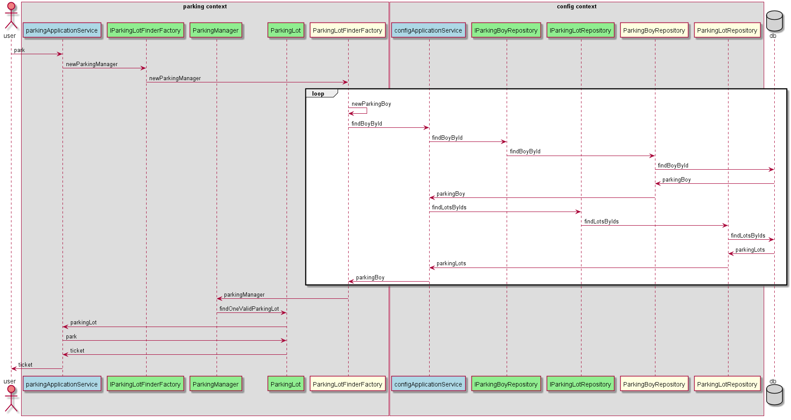

## Description

learn DDD by parking in multiple languages

## Model

now I have two context: parking and config

parking is the core context and config is a supporting context.

there is the parking's modeling:

and ther is the config's modeling:

and in the bussiness `park`, there is the sequence

## TypeScript

see in the folder ts

## Kotlin

see in  the folder kt

## CSharp

see in the folder cs
